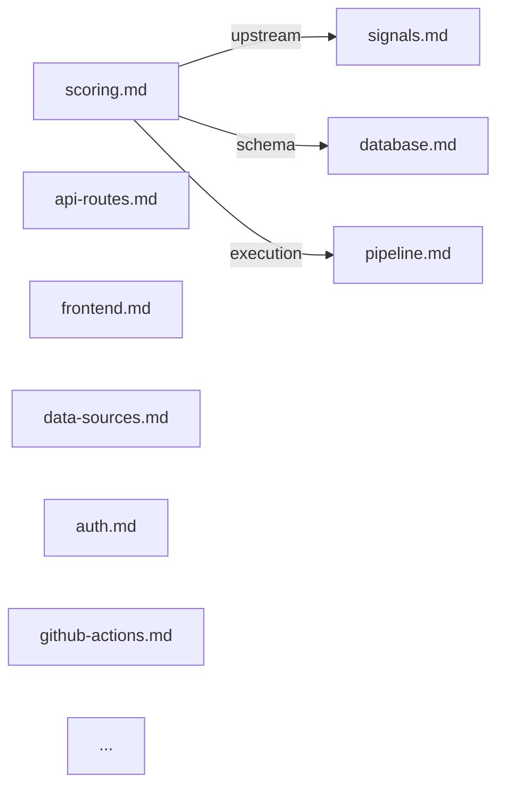

# Reference Graph

**TL;DR**: Generate a Mermaid diagram showing all reference files and their See Also connections. Output to `references/GRAPH.md`.

## When to Use
- After adding or restructuring reference files
- For onboarding (visual overview of knowledge architecture)
- To spot structural gaps (isolated nodes, missing connections)

## Process

### 1. Scan All Reference Files
Read every `references/*.md` file. For each:
- Extract the file name (node)
- Extract all See Also links with relationship types

### 2. Build the Graph
Create a Mermaid `graph LR` diagram where:
- Each reference file is a node
- Each See Also link is a labeled edge
- Relationship types become edge labels

### 3. Write Output
Write to `references/GRAPH.md`:

```markdown
# Reference Knowledge Graph

> Auto-generated by `cortex:graph`. Do not edit manually.
> Last generated: YYYY-MM-DD



## Metrics
- Nodes: [count]
- Edges: [count]
- Avg connections per node: [count]
- Isolated nodes (0 connections): [list or "none"]
```

### 4. Present Summary
Show the user:
- Total nodes and edges
- Average connections per node
- Any isolated nodes (structural gaps)
- Whether any reference file has fewer than 3 connections (below minimum density)

## Execution

Use Read tool to scan each reference file. Parse See Also sections with pattern matching. Build the Mermaid syntax. Write to references/GRAPH.md. GitHub renders Mermaid natively, so the graph is browsable in the repo.

---
## See Also
- [validate-refs](../validate-refs/SKILL.md) — Validates links that this skill visualizes [related]
- [plan-audit](../plan-audit/SKILL.md) — Gates 14-15 use the same reference graph for coverage checks [consumer]
